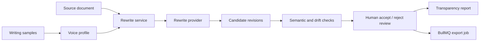

# VoicePreserve

VoicePreserve is a production focused web app for revising rough or AI assisted drafts so they sound more like the author while preserving meaning and transparency.


The application combines voice profile extraction, rewrite orchestration, sentence level semantic checks, human review, transparency reports, and asynchronous exports in one auditable workflow.

## Product boundaries

VoicePreserve is **not** a detector evasion tool.

It does not provide, market, or optimize for:
- bypassing AI detectors
- detector score gaming
- passing GPTZero, ZeroGPT, Turnitin, or similar systems
- concealment focused authorship workflows

It is built for:
- preserving meaning
- personalized voice alignment
- transparent editing records
- responsible AI use

## Tech stack

- Frontend + API: Next.js 16, TypeScript
- Database: PostgreSQL + Prisma ORM
- Queue/background jobs: Redis + BullMQ worker
- Storage: pluggable adapter (`local` included)
- Auth: email/password + Google OAuth with secure session cookie
- Testing: Vitest (unit/integration), Playwright (e2e)
- Local dev infra: Docker Compose

## Architecture



The Next.js application owns the web and API surfaces, PostgreSQL stores the editing record, and a separate BullMQ worker handles export jobs through Redis. Provider, storage, and queue boundaries are explicit so production services can replace the included local adapters.

### Implementation status

- The complete application flow, persistence layer, local rewrite provider, voice profiling, semantic checks, transparency reports, and export queue are implemented.
- `MockRewriteProvider` keeps local development deterministic and credential free; a production model provider must implement the contract in `src/lib/ai/provider.ts`.
- The repository includes unit, integration, and end to end test suites. Run the commands below in the target environment before treating a deployment as verified.

### Core services

- `src/lib/services/rewrite.ts`: revision orchestration and candidate persistence
- `src/lib/ai/provider.ts`: provider contract
- `src/lib/ai/mock-provider.ts`: local mock provider (no external credentials required)
- `src/lib/services/semantic.ts`: sentence level semantic fidelity and drift warnings
- `src/lib/services/voice-profile.ts`: style profile extraction from writing samples
- `src/lib/services/transparency.ts`: transparency report generation
- `src/lib/services/export.ts`: export artifacts and queue integration

### Data model

Defined in `prisma/schema.prisma` with migrations in `prisma/migrations/`.

Primary entities:
- users
- projects
- source_documents
- writing_samples
- voice_profiles
- revisions
- sentence_diffs
- transparency_reports
- export_jobs
- audit_events

## Privacy and security defaults

- minimal metadata logging by default
- raw draft logging disabled by default (`ENABLE_RAW_CONTENT_LOGGING=false`)
- CSRF token checks for authenticated mutating API calls
- secure HTTP only session cookie
- upload validation for allowed file types
- per IP API rate limiting middleware
- account privacy deletion endpoint to remove drafts/files/history (`/api/privacy/delete`)

## Auth providers

- Email/password: `/api/auth/signup` and `/api/auth/login`
- Google OAuth: `/api/auth/google/start` and `/api/auth/google/callback`

Set these env vars for Google login:
- `GOOGLE_CLIENT_ID`
- `GOOGLE_CLIENT_SECRET`

Google Cloud OAuth redirect URI must include:
- `http://localhost:3000/api/auth/google/callback` (local)
- `https://<your-domain>/api/auth/google/callback` (production)

## Core user flow implemented

1. Sign up/login (`/auth`)
2. Create project (`/dashboard`)
3. Add source text by paste or upload `.txt/.docx/.pdf`
4. Optionally upload writing samples and build voice profile (`/voice-profile`)
5. Generate one to three rewrite options in project editor (`/projects/[id]`)
6. Review sentence level diff and rationale
7. See semantic drift warnings (low similarity, named entities, claim strength, numbers/dates, citations)
8. Accept/reject sentence changes
9. Generate transparency report (`/transparency-report`)
10. Queue exports (final text, tracked diff, summary, transparency PDF)

## Local setup

### 1) Install dependencies

```bash
npm install
```

### 2) Configure environment

```bash
cp .env.example .env
```

### 3) Start infrastructure

```bash
docker compose up -d db redis
```

If Docker is unavailable on your machine, you can run local services with Homebrew:
```bash
brew install postgresql@16 redis
brew services start postgresql@16
brew services start redis
```

### 4) Run migrations and seed data

```bash
npm run prisma:generate
npm run prisma:migrate
npm run prisma:seed
```

### 5) Run app + worker

Terminal A:
```bash
npm run dev
```

Terminal B:
```bash
npm run worker
```

### Frontend only preview mode

If infra is not running yet, test the UI only at:
- `/preview`

### 6) Demo account

From `.env` defaults:
- email: `demo@voicepreserve.app`
- password: `DemoPass123!`

## Tests

```bash
npm run test
npm run test:e2e
```

## Health check

- `GET /api/health`

## Deployment notes

1. Use managed Postgres + Redis in production.
2. Replace local storage adapter with an S3 compatible adapter.
3. Set strong secrets (`JWT_SECRET`, `CSRF_SECRET`).
4. Run `npm run prisma:deploy` in CI/CD release phase.
5. Run worker as a separate process/service.

## Vercel deployment

1. Install and login:
```bash
npm i -g vercel
vercel login
```
2. Configure production env vars in Vercel project settings:
- `DATABASE_URL`
- `REDIS_URL`
- `JWT_SECRET`
- `CSRF_SECRET`
- `GOOGLE_CLIENT_ID`
- `GOOGLE_CLIENT_SECRET`
- `APP_URL`
- `COOKIE_NAME`
3. Deploy:
```bash
npm run deploy:vercel
```

## AWS + Docker IaC deployment

This repository includes Terraform and deployment helpers:
- Terraform: `infra/aws/terraform/`
- ECR image push helper: `scripts/push-ecr.sh`
- AWS plan helper: `scripts/deploy-aws.sh`

High level flow:
1. Build and push Docker image to ECR.
2. Set Terraform variables in `infra/aws/terraform/terraform.tfvars`.
3. Run `terraform init`, `terraform plan`, and `terraform apply`.
4. ECS runs separate app and worker services on Fargate.
5. RDS Postgres and ElastiCache Redis are provisioned in private subnets.

If `aws --version` fails with an expat symbol error on macOS, run commands with:
```bash
export DYLD_LIBRARY_PATH=/opt/homebrew/opt/expat/lib:$DYLD_LIBRARY_PATH
```

## Responsible copy guidance

Use copy emphasizing:
- preserve your meaning
- sound more like yourself
- track your editing process
- support responsible AI use

Do not use:
- undetectable
- bypass detectors
- beat GPTZero
- pass Turnitin
- evade AI detection
